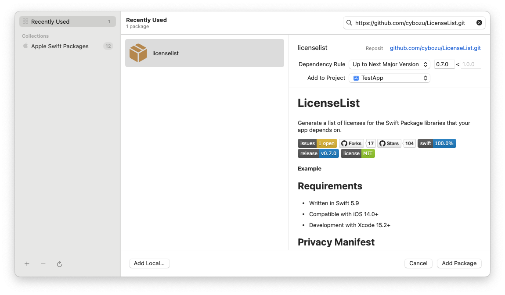
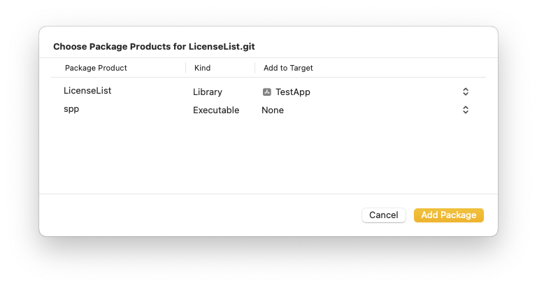

# LicenseList

Generate a list of licenses for the Swift Package libraries that your app depends on.

[](https://github.com/cybozu/LicenseList/issues)
[](https://github.com/cybozu/LicenseList/network/members)
[](https://github.com/cybozu/LicenseList/stargazers)
[](https://github.com/cybozu/LicenseList/)
[]()
[](https://github.com/cybozu/LicenseList/)

**Example**

<div>
  
  
  
</div>

## Requirements

- Development with Xcode 15.2+
- Written in Swift 5.9
- Compatible with iOS 15.0+

## Privacy Manifest

This library does not collect or track user information, so it does not include a PrivacyInfo.xcprivacy file.

## Installation

LicenseList is available through [Swift Package Manager](https://github.com/apple/swift-package-manager/).

**Xcode**

1. File > Add Package Dependencies…
2. Search `https://github.com/cybozu/LicenseList.git`.  
   
3. Add package and link `LicenseList` to your application target.  
   

**CLI**

1. Create `Package.swift` that describes dependencies.
   ```swift
   // swift-tools-version: 5.9
   import PackageDescription
   
   let package = Package(
       name: "SomeProduct",
       products: [
           .library(name: "SomeProduct", targets: ["SomeProduct"])
       ],
       dependencies: [
           .package(url: "https://github.com/cybozu/LicenseList.git", exact: "0.7.0")
       ],
       targets: [
           .target(
               name: "SomeProduct",
               dependencies: [
                   .product(name: "LicenseList", package: "LicenseList")
               ]
           )
       ]
   )
   ```
2. Run the following command in Terminal.
   ```sh
   $ swift package resolve
   ```

## Usage

### Example for UIKit

```swift
import LicenseList

// in ViewController
let vc = LicenseListViewController()
vc.title = "LICENSE"

// If you want to anchor link of the repository
vc.licenseListViewStyle = .withRepositoryAnchorLink

navigationController?.pushViewController(vc, animated: true)
```

### Example for SwiftUI

```swift
import LicenseList

struct ContentView: View {
    var body: some View {
        NavigationView {
            LicenseListView()
                // If you want to anchor link of the repository
                .licenseListViewStyle(.withRepositoryAnchorLink)
                .navigationTitle("LICENSE")
        }
    }
}
```


## Demo

This repository includes demonstration app for UIKit & SwiftUI.

Open [LicenseDemo/LicenseDemo.xcodeproj](/LicenseDemo/LicenseDemo.xcodeproj) and Run it.
