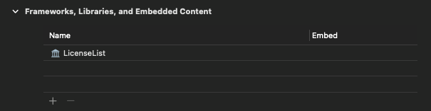
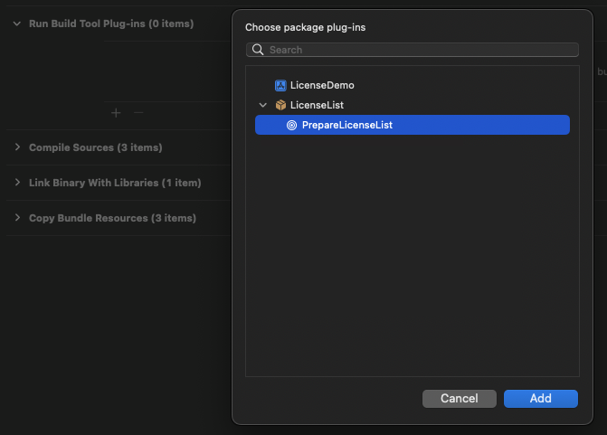

# LicenseList

Generate a list of licenses for the Swift Package libraries that your app depends on.

[](https://github.com/cybozu/LicenseList/issues)
[](https://github.com/cybozu/LicenseList/network/members)
[](https://github.com/cybozu/LicenseList/stargazers)
[](https://github.com/cybozu/LicenseList/)
[]()
[](https://github.com/cybozu/LicenseList/)

**Example**

|  |  |  |
| :--------------------------------: | :--------------------------------: | :--------------------------------------: |

## Supported License Types

- Apache license 2.0
- MIT License
- BSD 3-clause Clear license
- zLib License

## Requirements

- Written in Swift 5
- Compatible with iOS 13.0+
- Developement with Xcode 14.0.1+

## Installation

LicenseList is available through [Swift Package Manager](https://github.com/apple/swift-package-manager/).

1. Integrate LicenseList in your project
   - File > Add Packages...
   - Search `https://github.com/cybozu/LicenseList.git`
   - Choose `LicenseList` product and add it to your application target
2. Link LicenseList in your application target
   - Application Target > `General` > `Frameworks, Libraries, and Embedded Content` > `+`
   - Choose `LicenseList`  
   
3. Add PrepareLicenseList plugin to build phases
   - Application Target > `Build Phases` > `Run Build Tool Plug-ins` > `+`
   - Choose `PrepareLicenseList`  
   

## Usage

### Example for UIKit

```swift
import LicenseList

// in ViewController
let vc = LicenseListViewController()
vc.title = "LICENSE"
navigationController?.pushViewController(vc, animated: true)
```

### Example for SwiftUI

```swift
import LicenseList

struct ContentView: View {
    var body: some View {
        NavigationView {
            LicenseListView()
                .navigationTitle("LICENSE")
        }
    }
}
```


## Demo

This repository includes demonstration app for UIKit & SwiftUI.

Open [LicenseDemo/LicenseDemo.xcodeproj](/LicenseDemo/LicenseDemo.xcodeproj) and Run it.

## SourcePackagesParser (spp)

SourcePackagesParser is a command line tool that parses the license information of the Swift Package libraries on which the project depends based on workspace-state.json inside the DerivedData directory.

### Usage

```
$ swift run spp [output directory path] [SourcePackages directory path]
```

- [output directory path]  
  Path to the directory where the license-list.plist file will be placed.

- [SourcePackages directory path]  
  Example: `~/Library/Developer/Xcode/DerivedData/project-name-xxxxxxxx/SourcePackages`
